# Dynamische-KI-Expertengruppe

**MCP-Server-Tools** — Einzeldaten-Python-MCP-Server, der eine Runde KI-Experten (Claude, GPT, Gemini) dynamisch zusammenbringt, diskutieren lässt und ein Synthese-Ergebnis liefert.

[](https://python.org)
[](https://modelcontextprotocol.io)
[](https://litellm.vercel.app)
[](LICENSE)

---

## Architektur

Ein Chef-Modell moderiert eine asynchrone Debatte zwischen bis zu fünf KI-Experten-Modellen. Drei Phasen: **Completeness-Check** → **moderierte Debatte** → **Synthese**.

```mermaid
flowchart LR
  classDef client fill:#6366f1,color:#fff
  classDef server fill:#f59e0b,color:#fff
  classDef mode fill:#78716c,color:#fff
  classDef proxy fill:#3b82f6,color:#fff
  classDef model fill:#10b981,color:#fff
  classDef storage fill:#ef4444,color:#fff
  classDef deploy fill:#14b8a6,color:#fff
  classDef test fill:#ec4899,color:#fff
  classDef decision fill:#78716c,color:#fff

  subgraph Client["CLIENT"]
    direction TB
    C["MCP-Client (OpenCode)\nIT: ruft JSON-RPC-Tools auf | Alle: KI-Assistent"]
  end

  subgraph Transport["TRANSPORT"]
    direction TB
    TM{"MCP_TRANSPORT"}
    Stdio["stdio\nIT: stdin/stdout-Pipe | Alle: Direktverbindung"]
    SSE["sse\nIT: HTTP-Server :8000 | Alle: Netzwerkzugriff"]
    TM -->|"Default"| Stdio
    TM -->|"MCP_TRANSPORT=sse"| SSE
  end

  subgraph Server["MCP DEBATE SERVER"]
    direction TB
    S["advanced_debate_server.py\nIT: FastMCP, 3-Phasen-Debatte | Alle: KI-Debattenleiter"]
    L["📁 Debate Logs\nIT: logs/debates/*.md | Alle: Gesprächsprotokolle"]
    S -.->|"schreibt"| L
  end

  subgraph Modi["BETRIEBSMODI (LITELLM_API_BASE)"]
    direction TB
    PM["Proxy-Modus\nIT: OpenAI Client, max_retries=0 | Alle: sendet an KI-Verteiler"]
    DM["Direkt-Modus\nIT: litellm.completion + RateLimit | Alle: spricht direkt mit KI"]
    RL["⏱ RateLimiter\nIT: Token-Bucket 10 RPM | Alle: Drosselt bei Überlast"]
  end

  subgraph Proxy["LITELM PROXY (VPS / DOCKER)"]
    direction TB
    G["🔄 LiteLLM Gateway :4000\nIT: YAML-Routing, latency-based | Alle: KI-Verteiler"]
    CFG["📄 Proxy-Config\nIT: beispiel-config.yaml | Alle: Modelle & Einstellungen"]
    PG["🗄 PostgreSQL :5432\nIT: Usage-DB, API-Keys | Alle: Verwaltungsdatenbank"]
    G -.->|"liest"| CFG
    G -.->|"speichert"| PG
  end

  subgraph Modelle["KI-MODELLE (CLOUD-APIS)"]
    direction TB
    CLD["Claude 3.5 Sonnet\nIT: anthropic API | Alle: KI von Anthropic"]
    GPT["GPT-4o\nIT: openai API | Alle: KI von OpenAI"]
    GEM["Gemini 2.5 Flash\nIT: google API | Alle: KI von Google"]
  end

  subgraph Deploy["DEPLOYMENT (DOCKER)"]
    direction TB
    D["🐳 Dockerfile\nIT: python:3.12-slim | Alle: Server-Paket"]
    DC["📦 docker-compose.yml\nIT: Server + LiteLLM :4000 | Alle: Vorkonfiguriertes Setup"]
    N["🌐 NGINX\nIT: proxy_buffering off für SSE | Alle: Internet-Empfang"]
    D -->|"docker build"| DC
    DC -->|"proxied by"| N
  end

  subgraph Test["TEST-INFRASTRUKTUR"]
    direction TB
    NV["🧪 NVIDIA NIM\nIT: deepseek-v4-flash | Alle: Test-KI-Modell"]
    TC["🧪 docker-compose.test.yml\nIT: PG + LiteLLM + Server | Alle: Vollständige Test-Umgebung"]
    NV <-->|"vollständiger Stack"| TC
  end

  C <-->|"MCP-Protokoll (JSON-RPC)"| TM
  Stdio <-->|"request/response"| S
  SSE <-->|"request/response"| S
  S -->|"LITELLM_API_BASE gesetzt"| PM
  S -->|"LITELLM_API_BASE leer"| DM
  PM -->|"OpenAI Client"| G
  DM -->|"litellm.completion"| RL
  RL -->|"max 10 RPM"| G
  G <-->|"anfragen / antworten"| CLD
  G <-->|"anfragen / antworten"| GPT
  G <-->|"anfragen / antworten"| GEM
  G -.->|"optional"| NV
  S -.->|"verpackt als"| D

  class C client
  class S server
  class L storage
  class TM,Stdio,SSE decision
  class PM,DM mode
  class RL test
  class G proxy
  class CFG,PG storage
  class CLD,GPT,GEM model
  class D,DC,N deploy
  class NV,TC test
```



[📐 Vollständiges Diagramm als Gist](https://gist.github.com/peter-eske/20ac8d850440b071579dac0bf1009475)

---

## Features

| | |
|---|---|
| **🧠 Multi-Modell-Debatte** | Claude, GPT-4o und Gemini diskutieren Ihre Frage als unabhängige Experten |
| **🎩 Chef-Moderation** | Ein Leitmodell steuert die Debatte dynamisch: rollenbasiert, parallel, zielgerichtet |
| **⏱ Hard Timeout** | Konfigurierbare Maximaldauer (Default 120s) – keine Endlos-Debatten |
| **🔀 Zwei Betriebsmodi** | Proxy-Modus (OpenAI-Client, kein Rate-Limiting) oder Direkt-Modus (litellm, mit Rate-Limiter) |
| **📁 Automatische Logs** | Jede Debatte wird als lesbare Markdown-Datei gespeichert |
| **🐳 Docker-Ready** | Single-Stage Dockerfile + docker-compose für Produktion und Tests |

---

## Quick Start

```bash
# Venv aktivieren
.venv\Scripts\Activate.ps1

# Dependencies installieren
pip install -r requirements.txt

# Server starten (stdio – Standard)
python advanced_debate_server.py

# Oder mit Hot-Reload
fastmcp dev advanced_debate_server.py
```

Zum Ausführen wird ein API-Key für mindestens eines der Modelle benötigt. Im **Proxy-Modus** (empfohlen) liegt der Key auf dem LiteLLM-Proxy; im **Direkt-Modus** wird ein `LITELLM_API_KEY` benötigt.

---

## Umgebungsvariablen

| Variable | Effekt | Standard |
|---|---|---|
| `LITELLM_API_BASE` | **gesetzt** → Proxy-Modus (kein Rate-Limiting, OpenAI-Client); **nicht gesetzt** → Direkt-Modus (Rate-Limiting, litellm.completion) | `http://localhost:4000` |
| `LITELLM_API_KEY` | API-Key für den Proxy | `""` |
| `LITELLM_LOG` | Log-Level für litellm | — |
| `LITELLM_SUPPRESS_INFO` | Provider-List-Spam unterdrücken | — |
| `NVIDIA_RPM` | Requests pro Minute im Direkt-Modus | `10` |
| `MCP_TRANSPORT` | `stdio` oder `sse` | `stdio` |
| `PORT` / `HOST` | SSE-Port/Host | `8000` / `0.0.0.0` |

---

## Betriebsmodi

| Modus | `LITELLM_API_BASE` | API-Client | Rate-Limiting |
|---|---|---|---|
| **Proxy** | ✅ gesetzt | `openai.OpenAI` (max_retries=0) | ❌ deaktiviert |
| **Direkt** | ❌ nicht gesetzt | `litellm.completion()` | ✅ Token-Bucket (10 RPM) |

### Proxy-Modus (empfohlen)

Der Server nutzt einen OpenAI-kompatiblen Client und sendet alle Anfragen an einen LiteLLM-Proxy, der die API-Keys verwaltet und das Routing übernimmt. **Keine Wartezeiten**, kein Rate-Limiting.

```yaml
# docker-compose.yml (Auszug)
environment:
  - LITELLM_API_BASE=http://host.docker.internal:4000
```

### Direkt-Modus

Der Server spricht direkt mit den Modellen via `litellm.completion()`. Ein Token-Bucket-Rate-Limiter (Default 10 RPM) schützt vor Überlastung – konfigurierbar via `NVIDIA_RPM`.

---

## Tools

### `liste_verfuegbare_modelle()`

Gibt eine formatierte Liste aller verfügbaren Modelle zurück (via `litellm.utils.get_valid_models()`).

**Parameter**: Keine

### `konsultiere_expertengruppe(problemstellung, experten_modelle, maximale_sekunden)`

Führt eine vollständige Drei-Phasen-Debatte durch.

| Parameter | Typ | Default | Beschreibung |
|---|---|---|---|
| `problemstellung` | `str` | — | Ihre Frage oder Aufgabe (Pflichtfeld) |
| `experten_modelle` | `list[str]` | Default-Modelle | 1–5 Modelle aus der verfügbaren Liste |
| `maximale_sekunden` | `int` | 120 | Maximaldauer der gesamten Debatte |

**Default-Experten:**
```python
["claude-3-5-sonnet", "gpt-4o", "gemini/gemini-2.5-flash"]
```

---

## Tests

Eigener Test-Runner (kein pytest, kein unittest):

```bash
# Alle Tests
python test/test_debate_server.py

# Nur Kategorie A (Grundlagen)
python test/test_debate_server.py -k grund

# Ausführlich
python test/test_debate_server.py -v
```

**6 Test-Kategorien:**

| Kategorie | Beschreibung |
|---|---|
| A – Grundlagen | Environment, LiteLLM-Verbindung |
| B – MCP-Transport | Tool-Registrierung, -Aufruf (stdio) |
| C – Debatten-Logik | Vollständige Debatte, NEED_INFO, Timeout |
| D – SSE-Transport | HTTP-Server, SSE-Endpoint |
| E – Protokoll-Ausgabe | Format, Klassifikation, Dateipfad |
| F – Edge Cases | Fehlende API-Keys, leere Modell-Liste |

**Voraussetzung:** `test/.env` mit `NVIDIA_API_KEY` (NVIDIA NIM als Test-Modell).

---

## Docker

### Produktion (mit host-LiteLLM-Proxy)

```bash
docker compose up -d
```

### Test-Stack (PostgreSQL + LiteLLM + Debate-Server)

```bash
docker compose -f docker-compose.test.yml up -d
```

### Eigenständiges Build

```bash
docker build -t ghcr.io/peter-eske/mcp-debate-server:latest .
docker run -e LITELLM_API_BASE=http://proxy:4000 -e MCP_TRANSPORT=sse ghcr.io/peter-eske/mcp-debate-server:latest
```

**Wichtig für SSE:** NGINX benötigt `proxy_buffering off`, da SSE auf event-stream angewiesen ist.

---

## Debatten-Logs

Jede Debatte wird automatisch als Markdown-Datei unter `logs/debates/debate_{timestamp}.md` gespeichert. Enthält:

- Problemstellung und gewählte Modelle
- Vollständiges Diskussionsprotokoll aller Runden
- Finale Synthese mit Klassifikation (`ERFOLG` / `TEILERGEBNIS` / `RATLOSIGKEIT`)

---

## Entwicklung

```bash
# Hot-Reload
fastmcp dev advanced_debate_server.py

# Dependencies
pip install -r requirements.txt
```

Das Projekt verwendet ausschließlich:
- `mcp==1.27.1` — FastMCP-Server
- `litellm==1.86.0` — LLM-Gateway

**Wichtig:** `botocore` muss in der venv installiert sein (taucht als Abhängigkeit von litellm auf), sonst erscheinen `EventStream`-Warnungen bei Bedrock/SageMaker.
