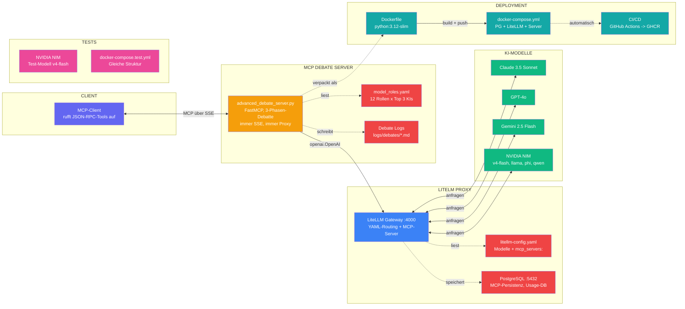

# Dynamische-KI-Expertengruppe

**MCP-Server-Tools** — Einzeldaten-Python-MCP-Server, der eine Runde KI-Experten dynamisch zusammenbringt, diskutieren lässt und ein Synthese-Ergebnis liefert. Läuft immer SSE, immer über LiteLLM-Proxy.

[](https://python.org)
[](https://modelcontextprotocol.io)
[](https://litellm.vercel.app)
[](LICENSE)

---

## Architektur

Ein Chef-Modell moderiert eine asynchrone Debatte zwischen bis zu fünf KI-Experten-Modellen. Drei Phasen: **Completeness-Check** → **moderierte Debatte** → **Synthese**.



[📐 Vollständiges Diagramm als Gist](https://gist.github.com/peter-eske/20ac8d850440b071579dac0bf1009475)

---

## Features

| | |
|---|---|
| **🧠 Multi-Modell-Debatte** | Claude, GPT-4o, Gemini und NVIDIA NIM diskutieren als unabhängige Experten |
| **🎩 Chef-Moderation** | Ein Leitmodell steuert die Debatte dynamisch: rollenbasiert, parallel, zielgerichtet |
| **📋 12 Experten-Rollen** | Rollen aus `model_roles.yaml` (Architekt, Security, DevOps, uvm.) |
| **⏱ Hard Timeout** | Konfigurierbare Maximaldauer (Default 120s) – keine Endlos-Debatten |
| **🔌 Immer SSE** | Server läuft als HTTP-SSE-Endpoint, immer über LiteLLM-Proxy |
| **📁 Automatische Logs** | Jede Debatte wird als lesbare Markdown-Datei gespeichert |
| **🐳 Vollstack-Docker** | PostgreSQL + LiteLLM + Debate-Server in einem Stack |

---

## Quick Start

```bash
# Venv aktivieren
.venv\Scripts\Activate.ps1

# Dependencies installieren
pip install -r requirements.txt

# Server starten (SSE – Standard, immer)
python advanced_debate_server.py
```

LITELLM_API_BASE muss gesetzt sein. Der Server startet als SSE-Server auf Port 8000.

---

## Umgebungsvariablen

| Variable | Effekt | Standard |
|---|---|---|
| `LITELLM_API_BASE` | **Required** – URL zum LiteLLM-Proxy | – |
| `LITELLM_API_KEY` | API-Key für den Proxy | `""` |
| `PORT` / `HOST` | SSE-Port/Host | `8000` / `0.0.0.0` |

Nur **Proxy-Modus** – LITELLM_API_BASE muss gesetzt sein.

---

## Tools

### `liste_verfuegbare_modelle()`

Gibt eine formatierte Liste aller verfügbaren Modelle zurück (via `litellm.utils.get_valid_models()`).

**Parameter**: Keine

### `konsultiere_expertengruppe(problemstellung, experten_modelle, maximale_sekunden)`

Führt eine vollständige Drei-Phasen-Debatte durch.

| Parameter | Typ | Default | Beschreibung |
|---|---|---|---|
| `problemstellung` | `str` | – | Ihre Frage oder Aufgabe (Pflichtfeld) |
| `experten_modelle` | `list[str]` | Default-Modelle | 1–5 Modelle aus der verfügbaren Liste |
| `maximale_sekunden` | `int` | 120 | Maximaldauer der gesamten Debatte |

**Default-Experten**: Aus `model_roles.yaml` (`default_experten`), Fallback auf `claude-3-5-sonnet`, `gpt-4o`, `gemini/gemini-2.5-flash`.

---

## Experten-Rollen

Die `model_roles.yaml` definiert 12 Rollen mit je 3 Modell-Empfehlungen:

| Rolle | Beschreibung | Default-Modell |
|---|---|---|
| Projektmanager | Koordiniert, fasst zusammen, priorisiert | claude-3-5-sonnet |
| System-Architekt | Entwirft Architektur, Komponenten, Schnittstellen | gpt-4o |
| Code-Analyst | Analysiert Code, implementiert, optimiert | claude-3-5-sonnet |
| Security-Experte | Prüft Sicherheit, OWASP, Auth | claude-3-5-sonnet |
| DB-Spezialist | Datenbankdesign, Queries, Migrationen | gpt-4o |
| DevOps | Infrastruktur, CI/CD, Deployment | claude-3-5-sonnet |
| UI/UX-Designer | Oberflächen, Interaktion, Accessibility | gpt-4o |
| QA-Tester | Teststrategie, Testfälle, Automatisierung | claude-3-5-sonnet |
| Product-Owner | Anforderungen, User Stories | gpt-4o |
| Performance-Optimierer | Laufzeit, Speicher, Caching | deepseek-v4-flash |
| Dokumentations-Experte | Technische Dokumentation, API-Refs | gemini-2.5-flash |
| Kritischer-Reviewer | Code/Architektur-Review, Risikoanalyse | claude-3-5-sonnet |

---

## Tests

Eigener Test-Runner (kein pytest, kein unittest):

```bash
# Alle Tests
python test/test_debate_server.py

# Nur Kategorie A (Grundlagen)
python test/test_debate_server.py -k grund

# Ausführlich
python test/test_debate_server.py -v
```

**7 Test-Kategorien:**

| Kategorie | Beschreibung |
|---|---|
| A – Grundlagen | Environment, LiteLLM-Verbindung |
| B – MCP-Transport | Tool-Registrierung, -Aufruf (stdio) |
| C – Debatten-Logik | Vollständige Debatte, NEED_INFO, Timeout |
| D – SSE-Transport | HTTP-Server, SSE-Endpoint |
| E – Protokoll-Ausgabe | Format, Klassifikation, Dateipfad |
| F – Edge Cases | Fehlende API-Keys, leere Modell-Liste |
| G – MCP-Registrierung | Test der Fallback-Registrierung |

**Voraussetzung:** `test/.env` mit `NVIDIA_API_KEY` (NVIDIA NIM als Test-Modell).

---

## Docker

### Vollstack (PostgreSQL + LiteLLM + Debate-Server)

```bash
docker compose up -d
```

### Test-Stack

```bash
docker compose -f test/docker-compose.test.yml up -d
```

### Eigenständiges Build

```bash
docker build -t ghcr.io/peter-eske/mcp-debate-server:latest .
```

**CI/CD**: GitHub Actions baut und publiziert automatisch bei Änderungen an Dockerfile, Server, model_roles.yaml oder requirements.txt.

**Wichtig für SSE:** NGINX benötigt `proxy_buffering off`, da SSE auf event-stream angewiesen ist.

---

## Debatten-Logs

Jede Debatte wird automatisch als Markdown-Datei unter `logs/debates/debate_{timestamp}.md` gespeichert. Enthält:

- Problemstellung und gewählte Modelle
- Vollständiges Diskussionsprotokoll aller Runden
- Finale Synthese mit Klassifikation (`ERFOLG` / `TEILERGEBNIS` / `RATLOSIGKEIT`)

---

## Entwicklung

```bash
# Dependencies
pip install -r requirements.txt

# Server starten
python advanced_debate_server.py
```

Dependencies:
- `mcp==1.27.1` – FastMCP-Server
- `litellm==1.86.0` – LLM-Gateway
- `pyyaml==6.0.2` – YAML-Parser

**Wichtig:** `botocore` muss in der venv installiert sein, sonst erscheinen `EventStream`-Warnungen.
